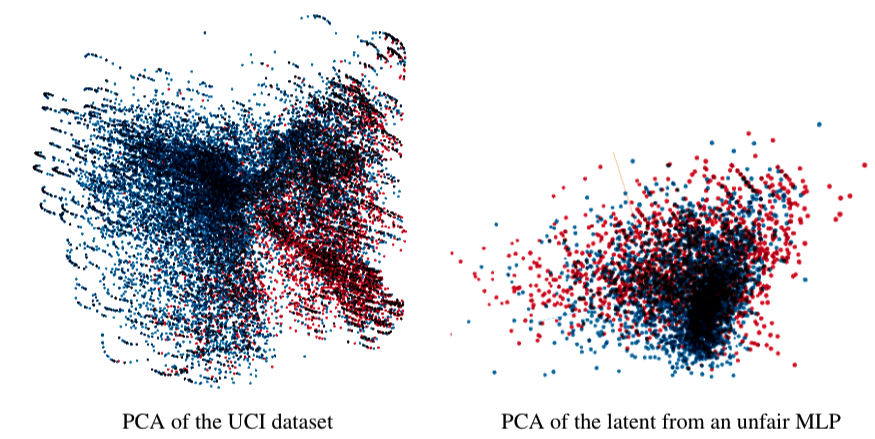

<h1 align="center"> Visualizing ML Fairness </h1>
<h1 align="center">
  
</h1>
<h2 align="center"> Authors </h2>

[Sid Gupta*](cs.toronto.edu/~sidgupta/), 
[Tina Li*](https://github.com/tinally), 
[Melissa Hu*](https://www.linkedin.com/in/xiaomeng-hu-381a78170/)

<h2 align="center"> Abstract </h2>

A remarkable byproduct of machine learning is how it’s pushed the scientific community to define the idea of fairness, in terms of probability and logic. Such definitions are motivated by empirical results, but in the abstract they can be used in every field of science, to make them more accessible, justified, and united. In this paper, we visually interpret two algorithms that make machine learning models follow probabilistic fairness definitions. Our main contribution, though, is visualizing how these fairness definitions translate to differences in the weights, principle components, and latent representations of models. Our results show that visually, these fairness definitions bring models to put less stress on minority groups, which is the desired philosophical outcome. We hope that our work can make probabilistic fairness a more digestible concept to understand, and can encourage scientists in other fields to think about fairness in terms of data, weights, principal components, and latent representations.

### More Details 
View our [`visualizing_ml_fairness.pdf`](https://github.com/sidguptacode/Interpreting_Eyetracking_CNNs/blob/master/visualizing_ml_fairness.pdf) for more information. 

